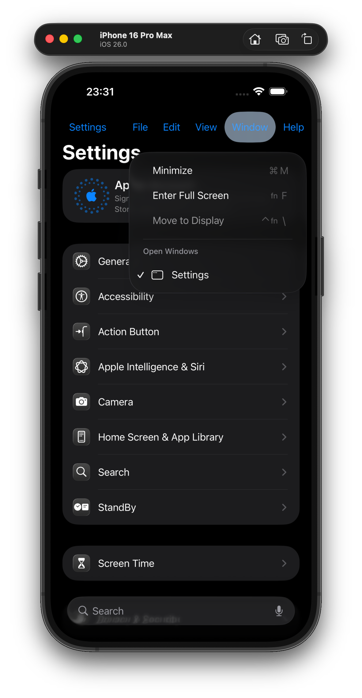

# PhoneMenuBar

```
(lldb) expr -l objc -i0 -O -- [[[[[[[SpringBoard sharedApplication] windowSceneManager] connectedWindowScenes] allObjects] firstObject] menuBarManager] setMenuBarVisible:0x1]
```


